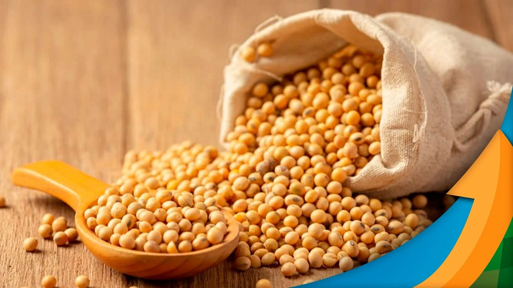

### Projeto Séries Temporais - Preço da Soja

Base de dados utilizada: https://www.cepea.esalq.usp.br/br/indicador/soja.aspx

A soja é um dos principais itens da agropecuária brasileira, com grande importância na pauta exportadora brasileira. Em 2022 a exportação da soja gerou mais de 46 bilhões dólares para o país, ficando em primeiro lugar entre os produtos com maior valor de exportação no ano. Esse excelente resultado tem dois componentes: preço e quantidade. Foram exportadas mais de 78 milhões de toneladas em 2022, colocando o Brasil como um dos maiores exportadores de soja do mundo ao lado dos Estados Unidos. Outro componente é o preço, que registra uma alta nos preços internacionais desde 2020, sendo que em 2022 a alta é de cerca de 12%.

Percebe-se a importância da soja para o país e para o mundo. Não é para menos, a soja é uma das principais fontes de alimentos do mundo. Está no óleo vegetal, em suplementos de proteínas, é fonte de alimentos para pessoas que não comem produtos de origem animal e o seu uso se estende para usos além da alimentação. A soja, portanto, está no dia a dia de grande parte da população animal.

Diante desse cenário, pode ser de grande importância prever o comportamento dos preços da soja para alguns setores. Com esse objetivo que este projeto é realizado. Faremos a investigação da série de preços da saca de 60kg da soja, série que pode ser encontrada no site destacado acima. Além disso, aplicaremos técnicas de séries temporais para avaliar a possibilidade da previsão dos preços dessa série.

O link do notebook é o seguinte: https://nbviewer.org/github/tharikf/Serie_Temporal_Preco_Soja/blob/main/Notebook_Projeto_Serie_Temporal_Soja.ipynb

  

